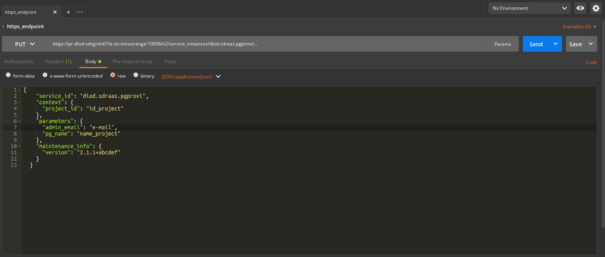
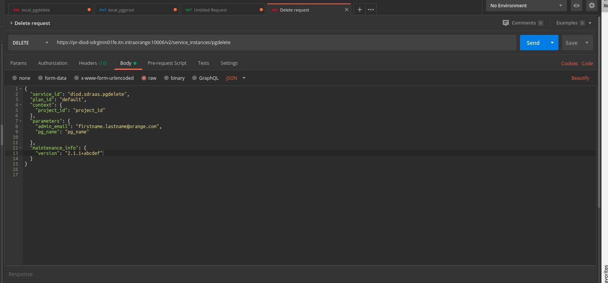

# Client SDR service (provision environment for sdr)


- This project is a service to provide an environment for client as service based on project id, project name, email address, and zone of SDR, the environment will contain the needed bigdata services in nifi as process group, the environment will have a relationship between each zone of SDR including exec, data, int, and gin. <br>
- The idea of the apps is to upload from template specific template called for now `SDR_SERVICE` and do inside it much modification, then create a connection between it and input **Route on project_id** and the output **DistributeLoad_zone** (the zone is should take the name of the zone on which will be created the environment)
## Usage

### I) Run apps with python script directly from the machine

We choose for provision environment chosen zone (SDR (nifi) ), project id and project name and email then we run this script `provision_env.py` with 4 parameters as follow:

The script should be run from (SDR admin machine prod with user **nifi**) because it is the only one that contains the python package `nipyapi` (nipyapi is the api that we use to communicate with nifi)
`python provision_env.py -p project_id -pn project_name -e e-mail -z zone
` <br>

`p`: project id of environment <br>
`pn`: project name or name of the process group that will be created <br>
`e`: email (orange email or any email allowed to the orange network)
`z`: zone of SDR nifi (gin, internet, exec, and data)

- Path of the script (in role client SDR service in GitLab) 

        path of `provision_env.py` = client_sdr_service/files/provisioning_service/provision_env.py
        
**conclusion**:  To run this script in 4 zones as one time, we will use Ansible 

###II) Run apps with ansible directly 

Run ansible-playbook  directly from machine (admin prod machine prsdradmnifi0101-0102-0103 with user **nifi**)

##### This is the steps :
2.1 - Git clone admin task project <br>
    
```git clone https://url_orange/Ansible_admin_tasks.git```

2.2 - Create `extravars.json` that contain this specific Infos  inside admin task project: <br>

        {
            "service_id": "diod.sdraas.pgprovi"
            "project_id": "id_project",
            "admin_email": "firstname.lastname@orange.com",
            "pg_name": "name of the project"
        }

2.3 - Run Ansible Playbook<br>

```ansible-playbook -i Inventory/nifi_01.pr.admin.diod.fe --private-key /home/nifi/.ssh/deploy_key  -e "@extravars.json" provision_env.yml```<br>

 #####Command description<br> 
 
```nifi_01.pr.admin.diod.fe ```: inventory that we use to deploy script across admin nodes<br>
```provision_env.yml```: playbook that we used to run all tasks inside this role  ((using service id as condition, playbook will run Creation))

###III) Run apps from https endpoint (directly in SDR)

This normally the first original version to activate the environment from SDR admin,this method is the operational one that use automatically stuff described above, first we begin sending a request from the postman to https endpoint in SDR gin after the request will be routed to the SDR admin to find pgprovi route to launch the ansible that I describe above.

1) Request to add on postman : <br>

        https://pr-diod-sdrginin01fe.itn.intraorange:10006/v2/service_instances/diod.sdraas.pgprovi/

2) Body to be added on postman on mode 'PUT'

         {
           "service_id": "diod.sdraas.pgprovi",
           "context": {
             "project_id": "id_project"
           },
           "parameters": {
             "admin_email": "e-mail",
             "pg_name": "name_project"
           },
           "maintenance_info": {
             "version": "2.1.1+abcdef"
           }
         }
         
     ##### Screenshot to show how it is the request in postman
     N.B : you should configure ssl context and proxy to enable requesting on postamn with this request 
    

#### JSON Description

```id_project```(mandatory): the convention always begins with 'p' and put after what you want without any space.<br>

```name_project```(mandatory): write any name but for now without any space

```email```(mandatory): write an orange email or any email that is allowed to our network.

#### Https Response 

JSON that contain  URLs of the created environment directly and also the response's status  (200,201,400)<br>

```200``` : environment already created ==> "ALREADY CREATED ENVIRONMENT"<br>
```201``` : environment created ==> "CREATE ENVIRONMENT" <br>
```400``` : bad request, it will contain specific message as errors for debugging 


- 200-OK response 

        {
          "project_id_created": "project_id",
          "pg_name_created": "pg_name",
          "request_sent_by": "firstname.lastname@orange.com",
          "operation": "ENV_ALREADY_CREATED",
          "info_response": "(project_id pg_name) envirnoment already Created",
          "nifi_gin_url": "https://pr-diod-sdrginnifi01fe.itn.intraorange/nifi/?processGroupId=${id_env_gin}",
          "nifi_int_url": "https://pr-diod-sdrintnifi01fe.itn.intraorange/nifi/?processGroupId=${id_env_int}",
          "nifi_exec_url": "https://pr-diod-sdrexecnifi01fe.itn.intraorange/nifi/?processGroupId=${id_env_exec}",
          "nifi_exec_url": "https://pr-diod-sdrdatanifi01fe.itn.intraorange/nifi/?processGroupId=${id_env_data}"
        }

- 201-create response 

        {
          "project_id_created": "project_id",
          "pg_name_created": "pg_name",
          "request_sent_by": "firstname.lastname@orange.com",
          "operation": "ENV_CREATED",
          "info_response": "(project_id pg_name) envirnoment successfully Created",
          "nifi_gin_url": "https://pr-diod-sdrginnifi01fe.itn.intraorange/nifi/?processGroupId=${id_env_gin}",
          "nifi_int_url": "https://pr-diod-sdrintnifi01fe.itn.intraorange/nifi/?processGroupId=${id_env_int}",
          "nifi_exec_url": "https://pr-diod-sdrexecnifi01fe.itn.intraorange/nifi/?processGroupId=${id_env_exec}",
          "nifi_exec_url": "https://pr-diod-sdrdatanifi01fe.itn.intraorange/nifi/?processGroupId=${id_env_data}"
        }

- 400-bad request response 

        {
          "project_id_created": "project_id",
          "pg_name_removed": "pg_name",
          "request_sent_by": "firstname.lastname@orange.com",
          "msg" : "error message"
        }

# Delete provisioned environment 

Sometimes customers will want to delete their older environment and create another one, or sometimes they will create the wrong one and want to delete it, for that we are delivering a service that deletes this created environment on the fly, we used for that also nipyapi to communicate with nifi. 
    
**Important** :
 
Some convention : 
- Project id should be unique,
- ControlRate must have the name : ControlRate-project_id (ex : ControlRate-p10000)
- UpdateAttribute processor must have the name of project_id
- Connection between Route on project id and process group environment should name of project_id 
 
If there is two similar project in the same nifi,`delete_env.py` will delete just identical connection and also the update attribute and ControlRate that contains the name of project id.
Normally, we use project id and pg name to delete process group from the canvas but for connection and update attribute always still using project_id.

### I) Delete apps with python script directly from the machine

We choose for deletion of environment a chosen zone (SDR (nifi) ), project id and project name and email then we run this script `delete_env.py` with 4 parameters as follow:

The script should be run from (SDR admin machine prod with user **nifi**) because it is the only one that contains the python package `nipyapi` (nipyapi is the api that we use to communicate with nifi).<br>

            `python delete_env.py -p project_id -pn project_name -e e-mail -z zone` 

`p`: project id of environment <br>
`pn`: project name or name of the process group that will be deleted <br>
`e`: email (orange email or any email allowed to the orange network)
`z`: zone of SDR nifi (gin, internet, exec, and data)

- Path of the script (in role client SDR service in GitLab) 

        path of `delete_env.py` = client_sdr_service/files/provisioning_service/delete_env.py
        
**conclusion**:  To run this script in 4 zones as one time, we will use Ansible 

###II) Delete apps with ansible directly 

Run ansible-playbook  directly from machine (admin prod machine prsdradmnifi0101-0102-0103 with user **nifi**) 

##### This is the steps :
2.1 - Git clone admin task project <br>
    
```git clone https://url_orange/Ansible_admin_tasks.git```

2.2 - Create `extravars.json` that contain this specific Infos  inside admin task project: <br>

        {
            "service_id": "diod.sdraas.pgdelete"
            "project_id": "id_project",
            "admin_email": "firstname.lastname@orange.com",
            "pg_name": "name of the project"
        }

`service _id`: is very important, with it we decide to do **creation** or **deletion**

2.3 - Run Ansible Playbook<br>

```ansible-playbook -i Inventory/nifi_01.pr.admin.diod.fe --private-key /home/nifi/.ssh/deploy_key  -e "@extravars.json" provision_env.yml```<br>

 #####Command description<br> 
 
```nifi_01.pr.admin.diod.fe ```: inventory that we use to deploy script across admin nodes<br>
```provision_env.yml```: playbook that we used to run all tasks inside this role (using service id as condition, playbook will run Deletion)

###III) Delete apps from https endpoint (directly in SDR)

This normally the first original version to Delete the environment from SDR admin, this method is the operational one that use  automatically stuff described above, first, we begin sending a request from the postman to https endpoint in SDR gin after the request will be routed to the SDR admin to find pgdelete route to launch the ansible that I describe above.

1) request to add on postman : <br>

        https://pr-diod-sdrginin01fe.itn.intraorange:10006/v2/service_instances/diod.sdraas.pgdelete/

2) body to be added on postman on mode 'PUT'

         {
           "service_id": "diod.sdraas.pgdelete",
           "context": {
             "project_id": "id_project"
           },
           "parameters": {
             "admin_email": "e-mail",
             "pg_name": "name_project"
           },
           "maintenance_info": {
             "version": "2.1.1+abcdef"
           }
         }
         
     ##### Screenshot to show how it is the request in postman
     N.B : you should configure ssl context and proxy to enable requesting on postamn with this request 
    

#### JSON Description

```id_project```(mandatory): the convention always begins with 'p' and put after what you want without any space.<br>

```name_project```(mandatory): write any name but for now without any space

```email```(mandatory): write an orange email or any email that is allowed to our network. (not used for now)

#### Https Response 

JSON that contain the response's status  (200,404,400)<br>

```200``` : Environment  Deleted ==> "DELETED ENVIRONMENT"<br>
```404``` : Environment  Not Found ==> "NOT EXIST ENVIRONMENT" <br>
```400``` : Bad request, it will contain specific message as errors for debugging 

**Response output example :** 

- 200-OK response 

        {
          "project_id_removed": "project_id",
          "pg_name_removed": "pg_name",
          "request_sent_by": "firstname.lastname@orange.com",
          "operation": "Deleted"
          "info_response": "(project_id pg_name) successfully Deleted",
          "warning-response": ""        (send warning if it will find warning)
        }

- 404-Not Found response 

        {
          "project_id_removed": "project_id",
          "pg_name_removed": "pg_name",
          "request_sent_by": "firstname.lastname@orange.com",
          "operation": "not exist"
          "info_response": "(project_id pg_name) not exist",
          "warning-response": ""        (send warning if it will find warning)
        }

- 400-bad request response 

        {
          "project_id_removed": "project_id",
          "pg_name_removed": "pg_name",
          "request_sent_by": "firstname.lastname@orange.com",
          "msg" : "error message"
        }
