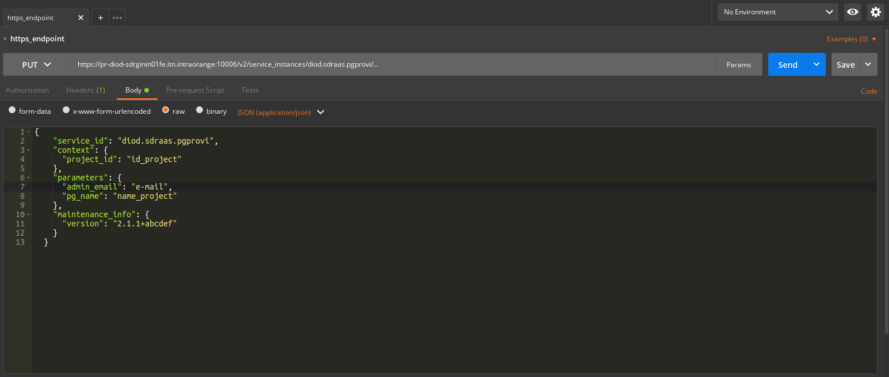

# Client SDR service (provision envirenement for sdr)


This project is a service to deploy a envirenement for client based on its input and all its needed bigata services provisionning in nifi and create relationship beetween each services

## Usage

### I) Run python script direcly from machine

we used for provision envirenement to choosen zone (sdr (nifi) ) the `provision_env.py` with for paramaters as follow:

`python provision_env.py -p project_id -pn project_name -e e-mail -z zone
` <br>

`p`: project id of envirerement <br>
`pn`: project name or name of process group that will be created <br>
`e` : email (orange email or any email allowed to the orange network)
`z` : zone of sdr nifi (gin, internet, exec and data)

- path of script (in role client sdr service in gitlab) 

        path of `provision_env.py` = client_sdr_service/files/provisioning_service/provision_env.py 
###II) Run apps with ansible direcly 

Run ansible playbook  direcly from machine (admin prod machine prsdradmnifi0101-0102-0103)

##### This is the steps :
1.1 - Git clone admin task project <br>
    
```git clone https://url_orange/Ansible_admin_tasks.git```

1.2 - create extravars that contain this specific infos  inside admin task project: <br>

        {
            "project_id": "id_project",
            "admin_email": "firstname.lastname@orange.com",
            "pg_name": "name of the project"
        }

1.3 - Run Ansible Playbook<br>

```ansible-playbook -i Inventory/nifi_01.pr.admin.diod.fe --private-key /home/nifi/.ssh/deploy_key  -e "@extravars.json" provision_env.yml```<br>

 #####Command description<br> 
 
```nifi_01.pr.admin.diod.fe ``` : inventory that we use to deploy script across admin nodes<br>
```provision_env.yml```: playbook that we used to run all tasks inside this roles

###III) Run apps from https endpoint (direcly in sdr)

This normaly the first original version to activate envirenement from sdr admin, first we begin sending request from postman to httpsendpoint in sdr gin, after the request will be routed to the sdr admin to find pgprovi route to launch the ansible that I describe above.

1) request to add on postman : <br>

        https://pr-diod-sdrginin01fe.itn.intraorange:10006/v2/service_instances/diod.sdraas.pgprovi/

2) body to be added on postman on mode 'PUT'

         {
           "service_id": "diod.sdraas.pgprovi",
           "context": {
             "project_id": "id_project"
           },
           "parameters": {
             "admin_email": "e-mail",
             "pg_name": "name_project"
           },
           "maintenance_info": {
             "version": "2.1.1+abcdef"
           }
         }
         
     #####Screenshot to show how it is the request in postman <br>

     N.B : you should configure ssl context and proxy to enable requesting on postamn with this request <br>

    

#### JSON Description

```id_project```(mandatory) : the convention is always begin with 'p' and put after what you want without any space.<br>

```name_project```(mandatory): write any name but for now without any space

```email```(mondatory): write orange email or any email that is allowed to our network.

#### Https Response 

Json that contain  urls of created envirenement direcly and also the response's status  (200,201,400)<br>

```200``` : envirenement already created ==> "ALREADY CREATED OPERATION"<br>
```201``` : envirenement created ==> "CREATE OPERATION" <br>
```400``` : bad request, it will contain specific message as errors for debugging 
